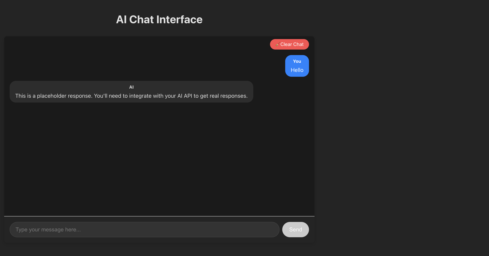

# Vite + Lit AI Chat Interface Template

This template provides a simple, modern chat UI built with [Vite](https://vitejs.dev/) and [Lit](https://lit.dev/). It's designed as a starting point for integrating AI chat models (such as Azure OpenAI, OpenAI, or your own backend) into a web application.



## Features

- ⚡️ **Vite** for fast development and builds
- ✨ **Lit** for lightweight, reactive web components
- 💬 **Chat UI** with persistent local history
- 🗂️ **Easy integration** with your AI backend (just replace a single function)

## Getting Started

### Prerequisites

- [Node.js](https://nodejs.org/)
- [npm](https://www.npmjs.com/) or [yarn](https://yarnpkg.com/)
- [Azure Developer CLI(azd)](https://learn.microsoft.com/en-us/azure/developer/azure-developer-cli/install-azd?tabs=winget-windows%2Cbrew-mac%2Cscript-linux&pivots=os-windows) installed

### File Structure

```markdown
webapp/
  ├── index.html
  ├── package.json
  ├── src/
  │   ├── main.js
  │   ├── index.css
  │   ├── components/
  │   │   ├── chat.js
  │   │   └── chat.css
  │   └── utils/
  │       └── chatStore.js
  └── public/
      └── vite.svg
```
- `chat.js`: Main chat UI component
- `chatStore.js`: Utilities for saving/loading chat history
- `chat.css`: Styles for the chat UI 

### Get the Code

If you already have the Azure Developer CLI installed on your machine, first login and select your subscription using

```sh
azd auth login
```

then run this command in a new directory to initialize the project.

```sh
azd init -t juliamuiruri4/vite-chat-interface
```

### Run the App

To start the development server, inside the project directory (root) run:

```sh
cd webapp
npm install
npm run dev
```

### To deploy the app on Azure

To deploy the app on Azure (Azure Static Web Apps), run:

```sh
azd up
```
This command will create the necessary Azure resources and deploy your app.

### Usage

The main chat component is **ChatInterface**. It stores messages in local storage and simulates AI responses. To connect to your own AI backend, replace the `_mockAiCall` method with your API call logic.